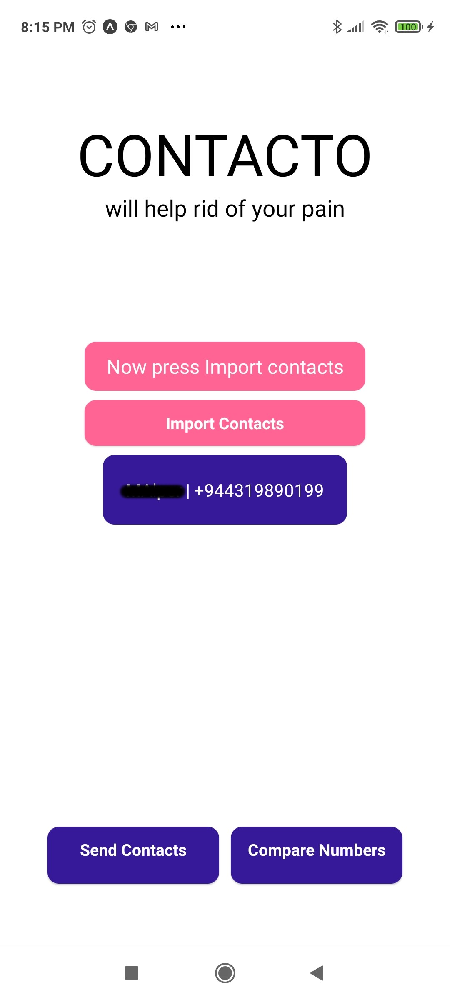
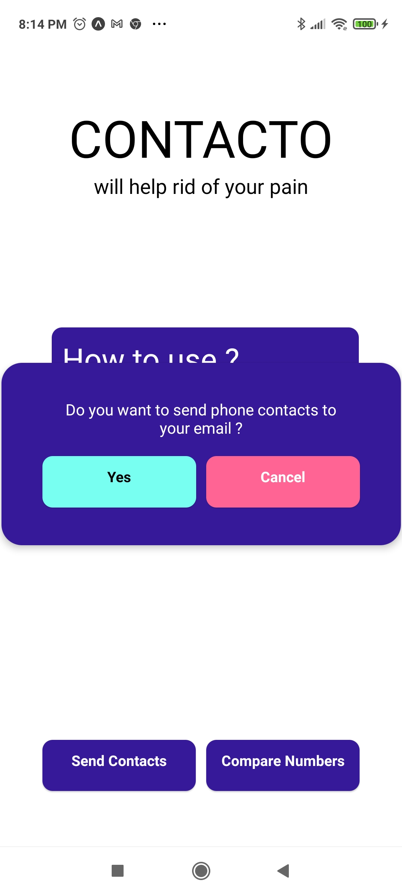

# Contacto 

|  |  |  |
|:---:|:---:|:---:|

# Description
  Contacto is an android app, that will transfer your contacts to your new phone.
  Project is created with Expo, React Native.

# Problem 
  Whenever you change your smartphone, you need to transfer your contacts to your new phone.
  Generally, I've forgot to store my contacts on google or any cloud service or somewhere.
  You can prefer not to store your contacts in google for some reason.

# Solution
  Contacto will create a file called contact.json. You can use this file on your new phone. You can send it via email or with any service.
  With your new smartphone, you can use that json file to compare values on your new phone. There might be numbers you forgot to add while adding manually.
  It'll create a new_contact.vcf on the fly then you can import on your phone.